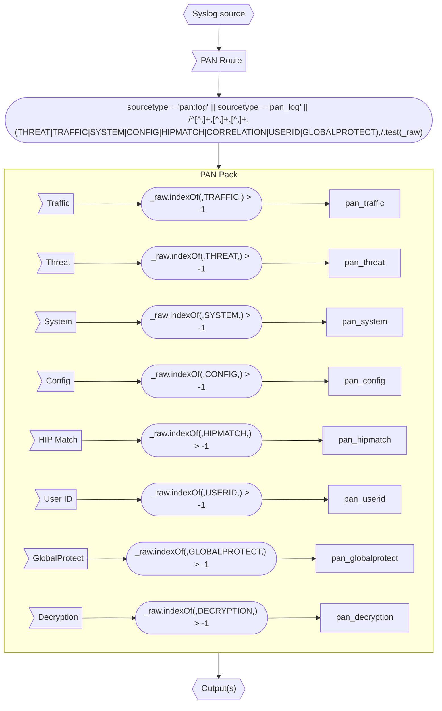

# PAN Pack Flow Diagram

The following diagram shows illustrates the general process flow followed by the PAN Pack.

This pack is typically applied to a main route under Routing>Data Routes or as a Quick Connect Pack (in the case of a single data source).

The general route filter can be found on the [README page](README.md#installation).

Once inside the pack, each route filter picks only the subtype of log it will process. E.g. Traffic, Threat, etc.

Data is then forwarded to the output(s) configured by the main route or Quick Connect.

